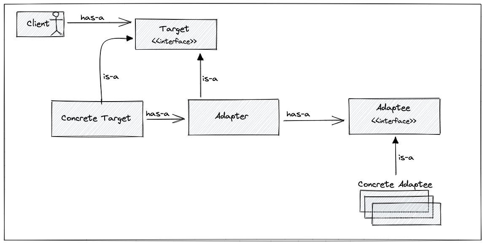
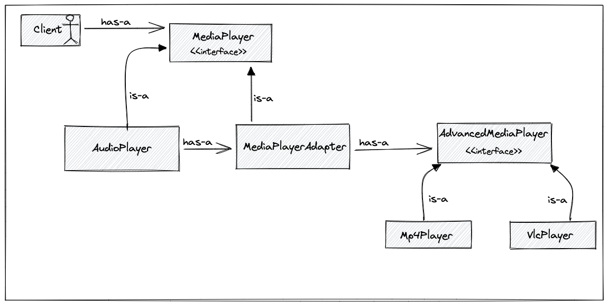

# Adapter Pattern

Making two interfaces that aren't compatible, make them compatible. Converts the interface over class into another class interface the client expect.

## General Pattern Structure

## Use-Case

