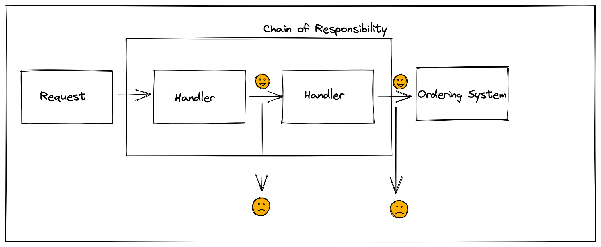

# Chain Of Responsibility Pattern

Chain of Responsibility is a behavioral design pattern that lets you pass requests along a chain of handlers. Upon receiving a request, each handler decides either to process the request or to pass it to the next handler in the chain.

## Pattern

## Use Case

Let's assume there is a hospital and patients. There are some steps for patients to complete their examination.

- Reception
- Doctor
- Cashier

