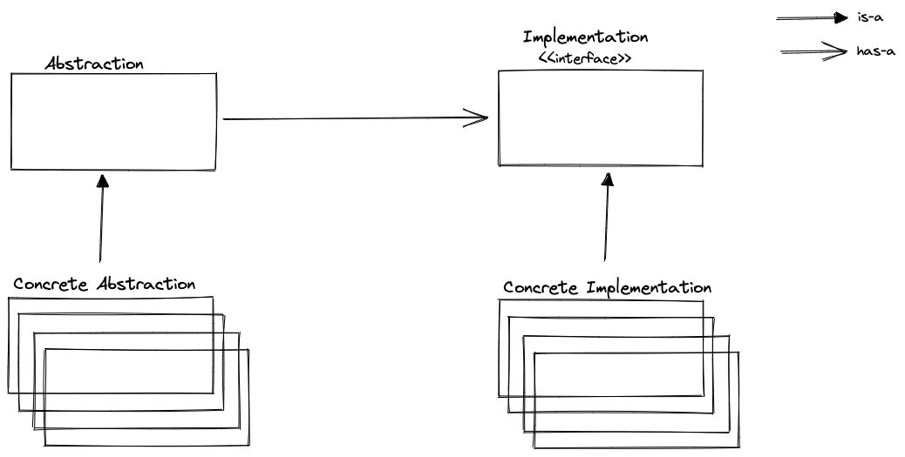

# Bridge Pattern

Bridge is structural design pattern that allow you to split two very related hierarchies.

## Problem

We have shapes and colors. We need to have combination of each. For example we have `yellow`, `red` colors and `square` and `circle` shapes. We need to have functionality of:

- `YellowSquare`
- `YellowCircle`
- `RedSquare`
- `RedCircle`

Whenever a new color or shape is added, hierarchy grows exponentially.

## Solution

If we have abstraction and implementations, we can solve cartesian product problem of creating different kind of classes.

