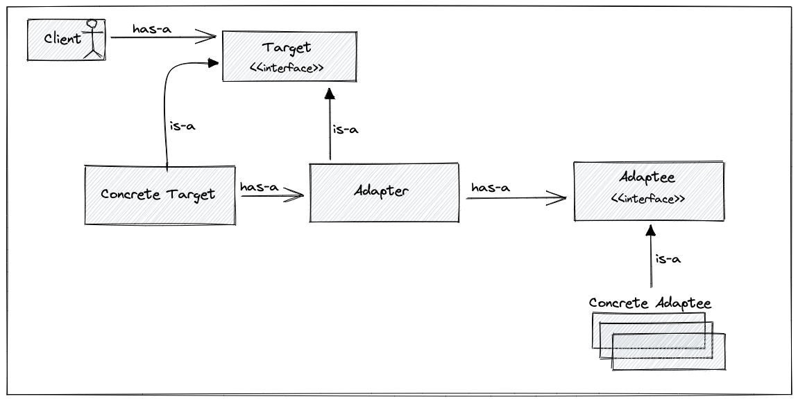
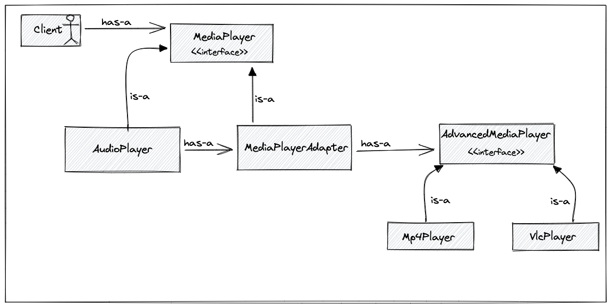

# Adapter Pattern

Making two interfaces that aren't compatible, make them compatible. Converts the interface over class into another class interface the client expect.

## General Pattern Structure

## Use-Case

- First we have only `mp3` player. We can only play `.mp3` files. 
- We want to play `.mp4` and `.vlc` files as well.
- But we don't want to change anything that written before.

